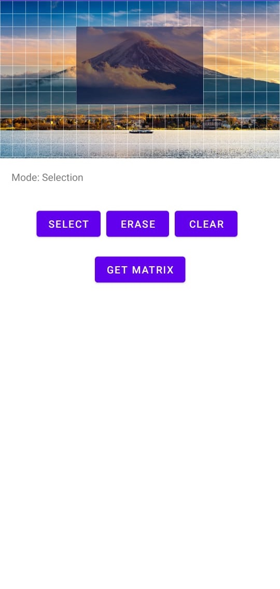

# PixelImageView
PixelImageView is used to capture the selected area of the image.<br>
<br>

UseAge
-------
gradle:
```grovvy
repositories {
    ...
    maven { url 'https://jitpack.io' }
}
...

dependencies {
    implementation 'com.github.naufalrzld:pixel-selector:1.0.1'
}
```

activty_main.xml:
```xml
<com.telkom.library.PixelImageView
    android:id="@+id/piv_image"
    android:layout_width="0dp"
    android:layout_height="0dp"
    app:piv_stroke_color="#000000"
    app:piv_selected_color="#FE8F7D"
    app:layout_constraintDimensionRatio="16:9"
    app:layout_constraintEnd_toEndOf="parent"
    app:layout_constraintStart_toStartOf="parent"
    app:layout_constraintTop_toTopOf="parent" />
```

MainActivity.kt:
```kotlin
val piv = findViewById<PixelImageView>(R.id.piv_image)

// Default mode
piv.mode = PixelImageView.Mode.None

// Activate selection mode
piv.mode = PixelImageView.Mode.Selection

// Activate erase mode
piv.mode = PixelImageView.Mode.Erase

// Clear all selector
piv.clearSelector()

// Get selection matrix
val matrix = piv.matrix
```

Example of Matrix:
```kotlin
[
    [0, 0, 0, 0, 0, 0, 0, 0, 0, 0, 0, 0, 0, 0, 0, 0, 0, 0, 0, 0, 0, 0],
    [0, 0, 0, 0, 0, 0, 0, 0, 0, 0, 0, 0, 0, 0, 0, 0, 0, 0, 0, 0, 0, 0],
    [0, 0, 0, 0, 0, 0, 1, 1, 1, 1, 1, 1, 1, 1, 1, 1, 0, 0, 0, 0, 0, 0],
    [0, 0, 0, 0, 0, 0, 1, 1, 1, 1, 1, 1, 1, 1, 1, 1, 0, 0, 0, 0, 0, 0],
    [0, 0, 0, 0, 0, 0, 1, 1, 1, 1, 1, 1, 1, 1, 1, 1, 0, 0, 0, 0, 0, 0],
    [0, 0, 0, 0, 0, 0, 1, 1, 1, 1, 1, 1, 1, 1, 1, 1, 0, 0, 0, 0, 0, 0],
    [0, 0, 0, 0, 0, 0, 1, 1, 1, 1, 1, 1, 1, 1, 1, 1, 0, 0, 0, 0, 0, 0],
    [0, 0, 0, 0, 0, 0, 1, 1, 1, 1, 1, 1, 1, 1, 1, 1, 0, 0, 0, 0, 0, 0],
    [0, 0, 0, 0, 0, 0, 0, 0, 0, 0, 0, 0, 0, 0, 0, 0, 0, 0, 0, 0, 0, 0],
    [0, 0, 0, 0, 0, 0, 0, 0, 0, 0, 0, 0, 0, 0, 0, 0, 0, 0, 0, 0, 0, 0],
    [0, 0, 0, 0, 0, 0, 0, 0, 0, 0, 0, 0, 0, 0, 0, 0, 0, 0, 0, 0, 0, 0],
    [0, 0, 0, 0, 0, 0, 0, 0, 0, 0, 0, 0, 0, 0, 0, 0, 0, 0, 0, 0, 0, 0]
]
```

Sample App:<br>

https://user-images.githubusercontent.com/27726885/193215133-83277052-360b-4e4d-a9de-5a1c6192c52f.mp4

